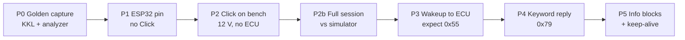
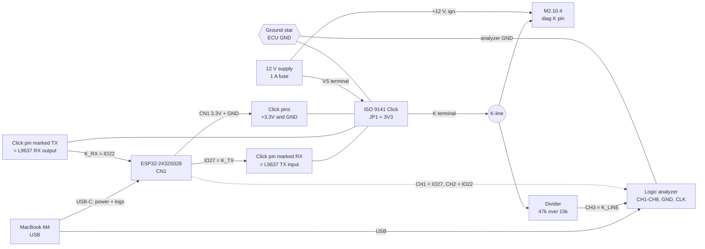

# ESP32 CYD → ISO 9141 Click → Bosch M2.10.4: KWP71 bring-up plan

> Exported on 2026-09-22 from the living doc: https://claude.ai/code/artifact/4488af84-1628-4651-98c8-372a3f4a854b
>
> Paths in this repo: sketches are in `firmware/`, Python tools in `tools/`, logic analyzer captures in `captures/`.

## Goal and starting point

The fastest route to a working ESP32 link is to copy the handshake that already works. First record the KKL cable's session on the K-line with the logic analyzer. Then make the ESP32's K-line trace match it, phase by phase.

| Path | Status | Evidence |
| --- | --- | --- |
| MacBook M4 → KKL / VAG-COM 409.1 (FTDI, `/dev/cu.usbserial-AH01164M`) → 3-pin Fiat/Alfa diag → M2.10.4 | Works | `kwp71_m2_10_4.py`: address 0x10, 4800 baud, 0x55 about 180 ms after the stop bit, then `32 86 04 15 26`, reply 0x79, info block = part number 0261204478. Confirmed again with `--probe` on 22 Sep 2026 |
| ESP32-2432S028 → MikroE ISO 9141 Click → K-line → M2.10.4 | **Works** on the real ECU: full handshake, ID blocks and live values (22 Sep 2026) | K on connector pin 3 plus shared ground on pin 2, 20 ms echo delay, LEN counts the 0x03, the ECU's repeated LEN byte handled. Reads 12.27 V, 18.0 °C and 0 rpm (engine off) |

The plan works outward from the ESP32 pin, and each phase has a pass check:

1. The ESP32 pin sends the correct 0x10 wakeup.
2. The Click reproduces that wakeup on the K-line.
3. The ECU answers with 0x55.
4. The ESP32 decodes the answer and replies 0x79.
5. The info blocks arrive.

If a check fails, the cause is in the one link that was added last.



Each box is one phase in the step-by-step plan below. Don't start a phase until the one before it passes its check.

## Parts and known protocol parameters

Everything the ESP32 has to reproduce is already proven by `kwp71_m2_10_4.py` against this ECU. Copy these values; don't guess new ones.

| Part | Role | Notes |
| --- | --- | --- |
| [ESP32-2432S028 "CYD"](https://github.com/witnessmenow/ESP32-Cheap-Yellow-Display/blob/main/PINS.md) | Tester MCU | Use connector CN1 (GND, IO22, IO27, 3.3V). UART2 on TX=GPIO27, RX=GPIO22. USB (UART0) stays free for logs. |
| [MikroE ISO 9141 Click](https://www.mikroe.com/iso-9141-click) (MIKROE-4331) | K-line transceiver, [L9637D](https://download.mikroe.com/documents/add-on-boards/click/iso_9141_click/iso-9141-click-schematic-v101.pdf) | JP1 selects logic level, and it **must be 3V3**. Has a 4.7 kΩ K-line pull-up to VS. The VS terminal takes 4.5–36 V. The L-line input is not needed. |
| USB logic analyzer (FX2 / "Saleae Logic" clone, sigrok `fx2lafw`) | Debugging | Pins CH1–CH8 (sigrok D0–D7), GND and CLK. Logic inputs only. It must never see 12 V directly. |
| Resistors 47 kΩ + 15 kΩ | K-line probe divider | Scales 14.4 V down to 3.5 V for analyzer CH3 |
| 12 V supply with 1 A inline fuse | ECU + Click VS | Use the same supply or battery that powered the ECU during the KKL tests |
| KKL / VAG-COM 409.1 + 3-pin Fiat/Alfa adapter | Golden reference only | Disconnect it before the Click touches the K-line |
| Bosch M2.10.4 (0261204478) | Target |  |

| Parameter | Proven value | Source |
| --- | --- | --- |
| Idle before wakeup | K-line high ≥ 2 s | script phase 1 |
| Wakeup address | 0x10, 5 baud, 8N1, LSB first, 200 ms/bit (start bit + 8 data + stop bit = 2.0 s) | `--address` default |
| Link speed after wakeup | 4800 baud 8N1 | `--baud` default, confirmed working |
| Sync | ECU sends 0x55 about **180 ms** after the stop bit (187 ms measured on the Mac, including up to \~16 ms of USB delay) | `--probe`, 22 Sep 2026 |
| Keyword | After 0x55 the ECU sends `32 86 04 15 26`. The tools read at most 5 bytes, so more may follow. Byte #1 = **0x86** | `--probe`, 22 Sep 2026 |
| Keyword reply | Complement of the keyword byte = **0x79** | `output.txt` |
| Reply delay | Both tools read up to 5 bytes after 0x55 (stopping early after a 150 ms gap), then wait 8 ms and send. This ECU sends exactly 5, so the reply goes out about 9 ms after the 5th byte | `--byte-timeout 0.15`, `--turnaround-ms 8`. Measure the real gap in the P0 capture |
| Block format | `LEN CTR TYPE DATA… 03`. **LEN counts the 0x03**: block 1 = `0D` → `01 F6` + 10 characters + `03`. The ECU always sends the LEN byte of its first block **twice**, because it doesn't accept the first echo. A 0x03 before the end is data | ESP32 raw trace, 22 Sep 2026. The old "LEN excludes 0x03" note was an illusion caused by the repeated byte |
| Lock-step echo | The receiver echoes every byte inverted, except the final 0x03. The ESP32 waits **20 ms** before each echo and before each byte it sends. At 0 ms the ECU rejects the echo; 10–30 ms all work | `send_block()` / `read_block()` |
| Self-echo | The transceiver's RX mirrors the K-line, so you receive every byte you send. Read it back and discard it | `write_byte_sync()`. The L9637D behaves the same as the KKL |
| ID blocks (3) | Type F6, ASCII reversed: `8744021620` = **0261204478** (Bosch hardware no.), `1497537301` = **1037357941** (Bosch software no.), `86152564` + `FF FF` = **46525168** (Alfa/Fiat part no.) | ESP32 on the real ECU, 22 Sep 2026 |
| Keep-alive | NOP / ACK block, type 0x09. The two sides strictly take turns: the ECU answers every tester block with exactly one block, the NOP included. Read that reply before sending again | `REQ["nop"]` |

## Wire diagram

Four signal wires, one K-line wire, and one ground star point. The Click's mikroBUS TX and RX are named from the Click's own side, so they cross over: **ESP32 GPIO27 goes to the Click's RX pin, and the Click's TX pin goes to GPIO22.** This matches the [schematic v101](https://download.mikroe.com/documents/add-on-boards/click/iso_9141_click/iso-9141-click-schematic-v101.pdf): L9637 pin 4 (TX) connects to mikroBUS RX, and pin 1 (RX) connects to mikroBUS TX.



Solid arrows show signal or power flow; the dotted arrow shows the analyzer probes on CN1. Every GND (ESP32 CN1, Click mikroBUS GND, Click VS−, ECU ground, 12 V supply −, divider bottom, analyzer GND) joins at the ground star.

**Logic analyzer pins.** The labels CH1–CH8 correspond to sigrok's names D0–D7, so the sigrok commands in this doc still say `-C D0=…`.

| Analyzer pin | sigrok name | Label in captures | Connect to |
| --- | --- | --- | --- |
| CH1 | D0 | K\_TX | CYD CN1 IO27 |
| CH2 | D1 | K\_RX | CYD CN1 IO22 |
| CH3 | D2 | K\_LINE | Divider node (47 kΩ / 15 kΩ), **never the K-line itself** |
| CH4–CH8 | D3–D7 |  | Leave unconnected |
| GND |  |  | Ground star (ECU GND) |
| CLK |  |  | Leave unconnected. It's an external clock input; sigrok samples on its own clock |

Check the mapping once: connect only CH1 to GND and run `sigrok-cli -d fx2lafw --samples 8 -O bits`. D0 should read all 0s, and the unconnected channels read 1s.

| From | Pin | To | Pin | Wire | Notes |
| --- | --- | --- | --- | --- | --- |
| CYD CN1 | IO27 | Click mikroBUS | **RX** | K\_TX | Crossover. Also probe it with analyzer CH1 |
| Click mikroBUS | **TX** | CYD CN1 | IO22 | K\_RX | Crossover. Also probe it with analyzer CH2 |
| CYD CN1 | 3.3V | Click mikroBUS | +3.3V | Logic supply | Only works with JP1 set to 3V3 |
| CYD CN1 | GND | Click mikroBUS | GND | Ground |  |
| Click | K-L terminal, **K** screw | ECU diag | K-line pin | K-line | Leave the L screw empty. Check which screw is K on the silkscreen |
| 12 V supply + (fused) |  | Click | VS terminal, VS | VS | 4.5–36 V |
| 12 V supply − |  | Click | VS terminal, GND | Ground | Also goes to the ECU ground |
| K-line |  | 47 kΩ → node → 15 kΩ → GND |  | Probe divider | Divider node goes to analyzer CH3 |
| Analyzer | CH1 / CH2 / CH3 / GND (CLK unused) | IO27 / IO22 / divider / ground star |  | Probes | sigrok D0 / D1 / D2, labelled K\_TX / K\_RX / K\_LINE |

**Finding the ECU's K pin:** use the same 3-pin Fiat/Alfa adapter the KKL worked through. On its OBD-16 side, K is pin 7, GND is pins 4 and 5, and +12 V is pin 16. Check with a multimeter which of the 3 pins connects to OBD pin 7. Tap the K-line, GND and +12 V there, for example with an OBD-16 breakout. That uses the path already proven with the KKL.

**3-pin Fiat/Alfa diagnostic connector on this ECU:** pin 1 has no wire to the ECU, pin 2 = **GND**, pin 3 = **K**. There's no L-line. Connect the Click's K screw to **pin 3**, and connect the Click's GND to **pin 2** as well as to the 12 V supply's minus. Without that shared ground the ECU doesn't respond.

## Safety and signal levels

The ESP32 and the analyzer run at 3.3 V logic; the K-line swings to about 12–14.4 V. One wrong wire can kill a GPIO or an analyzer channel, so check these before every power-up.

- [ ] **JP1 on the Click is set to 3V3.** At 5V the Click's RX output idles at 5 V, and GPIO22 is not 5 V tolerant.
- [ ] **Measure the Click's TX pin** (the wire going to GPIO22) with the Click powered but the ESP32 not yet connected. It should idle at about 3.3 V; if it reads higher, stop.
- [ ] **Never connect the K-line, VS or +12 V directly to the ESP32 or the analyzer.** Analyzer CH3 only connects to the divider node.
- [ ] **Check the divider:** 47 kΩ top, 15 kΩ bottom gives 14.4 V → 3.48 V and 12 V → 2.90 V. It reads as logic 1 above the 2.0 V threshold. A K-line low of ≤ 1 V reads as ≤ 0.25 V, logic 0.
- [ ] **One ground.** ESP32, Click, analyzer, 12 V supply and ECU all connect to the ECU ground. The Mac powers both the ESP32 and the analyzer, so its USB ground is already common with them.
- [ ] **Only one tester on the K-line.** Unplug the KKL before connecting the Click. Two pull-ups and two drivers corrupt every byte.
- [ ] **Fuse the 12 V feed at 1 A** and check VS polarity before closing the circuit.
- [ ] **Connect with the power off.** Make all connections with 12 V off, then power up in this order: 12 V, then the ESP32 over USB.

## Step-by-step bring-up

Seven phases, each ending in a pass check you can see on the analyzer. Capture at 100 kHz and save as `.sr`, then decode offline. Long captures sometimes stall on this Mac with `LIBUSB_ERROR_PIPE`. If one hangs, Ctrl-C and run it again.

### P0: Record the golden handshake with the KKL (about 20 min)

This records what "working" looks like on the wire. You'll compare every later phase against it.

1. Wire it the way that already works: KKL → 3-pin adapter → ECU, powered. Add only the divider on the K-line, with analyzer CH3 on the divider node and analyzer GND on ECU ground.
2. Start the capture, then the script, in one line:

```
sigrok-cli -d fx2lafw --config samplerate=100k --samples 1000000 -C D2=K_LINE -o golden.sr & sleep 0.5; python3 tools/kwp71_m2_10_4.py --port /dev/cu.usbserial-AH01164M; wait
```

3. Check the wakeup and decode the bytes:

```
sigrok-cli -i golden.sr -O csv:header=true:dedup=true:label=channel:time=true -o golden.csv
python3 tools/check_wakeup.py golden.csv --channel K_LINE --address 0x10
sigrok-cli -i golden.sr -P uart:rx=K_LINE:baudrate=4800 -A uart=rx-data --protocol-decoder-samplenum > golden_bytes.txt
```

4. In `golden_bytes.txt`, each sample number ÷ 100 = ms. Write down these five gaps:
   - W1: end of the wakeup stop bit → 0x55
   - KW1 → KW2 (0x86)
   - **W4: end of KW2 → start of 0x79** (the most important number)
   - 0x79 → the first ECU block's LEN byte
   - End of an ECU byte → start of the tester's inverted echo

**Pass:** `check_wakeup.py` prints `RESULT: OK - decoded 0x10`, and the decoded stream shows `55`, `86`, `79` and a first block containing ASCII digits.

**Fixed in `kwp71_m2_10_4.py` on 22 Sep 2026:** the tool used to clear its input 190 ms after the stop bit. This ECU's 0x55 arrives at about 187 ms, so it was thrown away, and `--probe` reported `never received 0x55` while the ECU was actually answering (it logged only `32 86 04`). The tool now listens from the end of the stop bit. It also waits for 0x55 by time, skipping stray bytes, instead of reading only 3 bytes.

### Firmware for P1–P5: `kwp71_m2104_esp32.ino`

Every ESP32 phase runs the same sketch unchanged. It's a port of the working Python script and repeats this cycle until it connects:

1. Hold the line idle high for 2 s.
2. Send the 0x10 wakeup on GPIO27, which takes 2.0 s.
3. Wait for 0x55, up to 3 × 800 ms.
4. Wait 1 s, then start again.

Follow it on the Serial Monitor at 115200 baud; the TFT shows the same log with less detail. These are the settings you may tune:

| Constant | Value | Controls |
| --- | --- | --- |
| `IDLE_BEFORE_MS` | 2000 | Idle-high time before the start bit |
| `BIT_MS` | 200 | 5-baud bit time |
| `N_SYNC`, `BYTE_TIMEOUT_MS` | 5, 150 | Reads up to 5 bytes after 0x55 and stops after a 150 ms gap. This ECU sends exactly 5 (`32 86 04 15 26`), so the reply goes out right after the 5th |
| `KW_POS` | 1 | Which byte after 0x55 is complemented (0x86 → 0x79) |
| `TURNAROUND_MS` | 8 | Delay before the keyword reply 0x79 (accepted by the ECU) |
| `ECHO_DELAY_MS` | 10 | Delay before every echo and every byte sent in a block exchange. Changed from 20 to 10 ms for faster rpm updates. 10 ms worked in the sweep, but hasn't been through a full session yet; go back to 20 if echoes get rejected |
| `ECU_LEN_INCLUDES_EOB` | 1 | LEN counts the 0x03 (confirmed on the real ECU) |
| `MAX_LEN_REPEATS` | 3 | How often the ECU may re-send a block's LEN byte (it always does once, for block 1) |
| `SELF_ECHO_TIMEOUT_MS` | 50 | How long to wait for our own byte to loop back through the L9637 |
| DEMO\_MODE | 0 | 1 = simulated dashboard values, no K-line traffic (see Dashboard) |

**How to capture a clean cycle:** start sigrok, then press the CYD's RST button within about 0.5 s. After a reset the start bit comes about 3 s in, so a 9 s capture holds one whole attempt. The first falling edge will be the real start bit, which is what `check_wakeup.py` needs.

### P1: ESP32 pin only (no Click, no 12 V)

1. Flash `kwp71_m2104_esp32.ino`. Connect analyzer CH1 to CN1 IO27 and analyzer GND to CN1 GND. Nothing else is connected.
2. Capture, pressing RST right after the command starts, then check:

```
sigrok-cli -d fx2lafw --config samplerate=100k --samples 900000 -C D0=K_TX -o p1.csv -O csv:header=true:dedup=true:label=channel:time=true
python3 tools/check_wakeup.py p1.csv --channel K_TX --address 0x10
```

**Pass:** `RESULT: OK - decoded 0x10`. The start bit comes after ≥ 2 s of high, and the frame is about 2.0 s long. The Serial log is expected to show `RX transitions …: 0` and `FAIL: no 0x55 sync byte` here, because nothing is connected to GPIO22.

### P2: Click on the bench, 12 V on, ECU not connected

1. Set JP1 to 3V3 and work through the safety checklist. Wire the ESP32 to the Click as in the wire table. Connect VS to the fused 12 V, and connect the divider to the Click's K screw only.
2. Probe CH1 = IO27, CH2 = IO22, CH3 = divider node.
3. Capture 900000 samples with `-C D0=K_TX,D1=K_RX,D2=K_LINE` (press RST), then run `check_wakeup.py` once for each channel.

**Pass:**

- All three channels decode 0x10. K\_LINE is the 12 V copy of the wakeup; K\_RX mirrors it.
- The Serial log shows `RX transitions seen during our own TX pulse: 3`. Anything else means the wakeup isn't getting from the K-line back to GPIO22.
- K\_LINE idles high between attempts, held up by the Click's 4.7 kΩ pull-up.

### P2b: Full session against the simulator (no ECU)

`m2104_sim.py` makes the MacBook and the KKL cable act as the M2.10.4. With it the whole firmware (wakeup, keyword, info blocks and polling) runs at your desk and can be repeated as often as you like, before the ECU is involved.

| Connect | To |
| --- | --- |
| Click K screw | KKL OBD pin 7 (K) |
| Fused 12 V | Click VS **and** KKL OBD pin 16 (the KKL needs 12 V to work) |
| GND | Click GND **and** KKL OBD pins 4 + 5 |

Keep the divider and CH1–CH3 as in P2. **Never have the real ECU on the same K-line.**

1. Start the simulator: `python3 tools/m2104_sim.py --port /dev/cu.usbserial-AH01164M`
2. Press RST on the CYD and watch both logs.

**Pass:**

- The simulator log shows `wakeup: … -> OK`, then `<- 79 keyword reply … -> OK`, the blocks `[info 1]`, `[info 2]` and `[final]`, then `== session up - answering requests ==`, followed by a steady flow of `RAM` / `ADC` answers.
- The ESP32 log shows `== HANDSHAKE COMPLETE ==` and `Batt:` lines, with no `Session lost`.

**Result on 22 Sep 2026:** passed. There were 35 poll cycles in 45 s (about 1.1 s each) with no `Session lost`, self-echo errors or echo errors. The keyword reply went out 160 ms after the keyword byte.

This run found one bug, now fixed. The sketch sent its NOP keep-alive but never read the ECU's reply block, so the next battery request collided with that reply. The log showed `self-echo 0x2 != sent 0x6`, and the session dropped after every first poll cycle.

The displayed values (`Batt: 0.21V RPM: 51 Cool: 140.4C`) are wrong with the simulator. The decode formulas read byte positions where the simulator's placeholder answers have the 0x03 end marker. A P0 capture of the real ECU will show whether the formulas or the placeholders are wrong.

**What the simulator can and can't tell you:**

- **Real values:** 0x10, 4800 baud, 0x55 after 180 ms followed by 32 86 04 15 26 (keyword 0x86 → reply 79), the reversed part number, and LEN not counting the 0x03 (wrong for the real ECU: LEN counts the 0x03, see P5).
- **Placeholders:** the gaps between the bytes after 0x55, every other delay, the block type bytes, info block 2, and the data answers.
- **Timing:** USB adds up to about 16 ms per read. A pass shows the firmware's logic is right; the real ECU remains the final test.
- **Expected note:** `note: tester LEN 03, this ECU profile would use 02` is normal. The sketch's `sendBlock()` counts the 0x03 in LEN, and the real ECU accepted that from the Python tool.

Once P0 gives you a real capture, copy the ECU's bytes and delays into a profile:

1. `python3 tools/m2104_sim.py --dump-profile > m2104.json`
2. Edit `m2104.json`.
3. Run with `--profile m2104.json`.

The simulator then replays your ECU instead of the placeholders.

### P3: Connect the ECU and expect 0x55

1. Turn 12 V off. Unplug the KKL. Connect the Click's K screw to the ECU's K pin, and join all grounds. Keep the divider on the K-line.
2. Turn 12 V and ignition on and wait 3 s. Start a capture of all three channels, then press RST.
3. Decode both lines:
   - `sigrok-cli -i p3.sr -P uart:rx=K_LINE:baudrate=4800 -A uart=rx-data --protocol-decoder-samplenum`
   - the same for K\_RX

**Pass:** 0x55 appears on K\_LINE and K\_RX, with a W1 close to P0. The Serial log no longer shows `FAIL: no 0x55`. The sketch's UART starts listening at the beginning of the stop bit, so it can't miss an early 0x55.

**Result on 22 Sep 2026: the first attempts failed, as below. Passed after moving K to pin 3 and adding the shared ground (see P3a).**

1. **Wrong pin first.** With the Click's K wire on the wrong ECU pin, the line was stuck low: `K-line idle level before wakeup: LOW` and `RX transitions: 0`. Taking the wire off the ECU brought back `HIGH` and 3, which proved the ECU side was pulling it low.
2. **Right pin, ECU on.** The line idles high and the wakeup goes out (`RX transitions: 3`), but the ECU sends nothing back: `nothing received at all` on every attempt.
3. **Same pin with the KKL** (Click's K wire removed): `kwp71_m2_10_4.py --probe` gets 0x55 after 187 ms, then `32 86 04 15 26`. So the ECU, its power and this pin are fine.

The KKL wakes the ECU and the Click doesn't. The most likely reason is the L-line: many KKL cables drive OBD pin 15 (L) together with K, and the Click can only receive on L, not drive it.

### P3a: Find out what wakes the ECU

There's one open question: what does the KKL do that wakes the ECU, which the Click doesn't? Two multimeter checks and one wiring test should answer it.

**Test 1: Map the 3-pin adapter** (multimeter on continuity, everything powered off). Check each of the adapter's 3 pins against its OBD socket. Also note which of the 3 pins the Click's K wire was on in P3.

| 3-pin adapter pin | → OBD 7 (K)? | → OBD 15 (L)? | → OBD 16 (+12 V) / 4, 5 (GND)? |
| --- | --- | --- | --- |
| Pin 1 |  |  |  |
| Pin 2 |  |  |  |
| Pin 3 |  |  |  |

**Test 2: Check the KKL cable** (cable unplugged). On its OBD plug, measure between pin 7 and pin 15.

- **About 0 Ω:** the cable ties K and L together, so its wakeup goes out on both lines.
- **Open:** it drives K only.

| Result | Meaning | Next |
| --- | --- | --- |
| An adapter pin goes to OBD 15, and the KKL connects 7 and 15 | The ECU most likely listens for the wakeup on **L** | Test 3 |
| No adapter pin goes to OBD 15 | L isn't the reason | If the Click was on the pin that goes to OBD 7, capture with the analyzer (below) |
| The Click was on a different pin than the one going to OBD 7 | Wrong pin | Move the Click's K wire to that pin and let the ESP32 retry |

**Test 3: Bridge L to K** (only if Test 1 finds an L pin):

1. Unplug the KKL.
2. Connect the Click's K wire to the adapter's K pin, and put a jumper wire from the L pin to the K pin. That copies what the KKL cable does internally.
3. Turn on the ECU and watch the ESP32 log. The ESP32 retries by itself about every 7 s.

**Pass:** `0x55 SYNC received`, then `Keyword[1]=0x86 -> reply 0x79`, then `== HANDSHAKE COMPLETE ==`.

**If Tests 1 and 2 don't settle it:** capture the KKL waking the ECU with the logic analyzer.

- **Probes:** CH3 through the divider on the K pin, and CH4 through a **second** 47 kΩ / 15 kΩ divider on the adapter's other signal pin.
- **What it shows:** which line carries the wakeup, and which one the ECU answers on.
- **What else it gives you:** the golden capture from P0, including whether the ECU sends more than 5 bytes after 0x55.

**Result of P3a (22 Sep 2026):** Test 1 answered it. There's **no L-line**: connector pin 1 has no wire to the ECU, pin 2 is GND and pin 3 is K. The earlier symptoms fit the Click's K wire being on pin 2 at first (line stuck low), then on pin 1 (idle high, no answer). With K on **pin 3** and the Click's GND on **pin 2**, the ECU answers the ESP32: 0x55 at 192 ms after the stop bit, then `32 86 04 15 26`.

### P4: Keyword reply

**Pass:** the Serial log shows:

```
0x55 SYNC received
Bytes after 0x55: xx 86
Keyword[1]=0x86 -> reply 0x79
Handshake OK - addr 0x10
```

There's no `WARN: no clean self-echo of the reply` message. K\_LINE shows `55 xx 86 79`. Compare the 86→79 gap with W4 from P0. If it differs by more than a few ms, adjust `BYTE_TIMEOUT_MS` (the main part of the gap) and `TURNAROUND_MS`.

**Result on 22 Sep 2026: passed.** The ESP32's raw trace shows 0x55 at 192 ms after the stop bit, then `32 86 04 15 26` at 10 ms intervals. Our 0x79 went out 7.4 ms after the 5th byte, and the ECU accepted it: its first block followed about 100 ms later.

### P5: Info blocks, echo and keep-alive

The sketch reads 2 info blocks, sending an ACK (type 0x09) after each, then the ECU's final block. After that, each poll cycle is four request / reply exchanges: battery, rpm, coolant, and the NOP keep-alive. The sketch reads the ECU's reply to every one, including the NOP, then waits 300 ms. It stops the cycle at the first failed exchange and reconnects. The Python REPL now reads the ECU's reply to its ACK after each command in the same way.

How `readBlock()` handles a block (corrected 22 Sep 2026 from a raw trace on the real ECU):

- **LEN counts the 0x03** (`ECU_LEN_INCLUDES_EOB` = 1). A 0x03 before that point is data, such as a counter of 03.
- **The ECU always sends the LEN byte of its first block twice,** because it doesn't accept our first echo, even with a 30 ms delay. `readBlock()` echoes the repeat without storing it and logs `ECU repeated LEN 0xd 1x`. Before this fix, the repeat was stored as the counter, our ACK went out with counter `0E` instead of `02`, and the ECU answered with a NAK.
- **Every echo and every sent byte waits `ECHO_DELAY_MS` = 20 ms.** Echoing at 0 ms made the ECU give up after three LEN repeats.
- **Fallback:** if the 0x03 isn't where LEN says, it logs `expected EOB after N bytes … scanning on` and keeps searching up to LEN + 4 bytes.
- **Raw trace:** when a block fails, the sketch prints every byte with a microsecond timestamp: `TX` sent, `SE` self-echo, `RX` from the ECU.

`kwp71_m2_10_4.py` and `m2104_sim.py` still assume that LEN excludes the 0x03, and they don't handle the repeated LEN yet.

**Pass:**

- A `block ctr=…` line shows the ASCII part number reversed, `'8744021620'` (0261204478).
- The log then shows `== HANDSHAKE COMPLETE ==`.
- `Batt:` lines keep coming for ≥ 30 s with no `Session lost` message.
- Compare the K\_LINE decode with `golden_bytes.txt` byte by byte.

**Result on 22 Sep 2026: passed.** The log shows `== HANDSHAKE COMPLETE (echo delay 20 ms) ==`, and the ESP32 then polled for 40 s with no `Session lost`. The counters ran 01 → 02 → … without a NAK.

| ID block | As sent | Reversed | Meaning |
| --- | --- | --- | --- |
| 1 | 8744021620 | 0261204478 | Bosch hardware no. |
| 2 | 1497537301 | 1037357941 | Bosch software no. |
| 3 (final) | 86152564 + FF FF | 46525168 | Alfa/Fiat part no. |

Reply blocks are `[counter, type, data…, 03]`, so the first data byte is `blk[2]`. The Python formulas read one byte too far, which gave 0.21 V and 140 °C.

| Value | Request | Reply | Decode | Shows | Check |
| --- | --- | --- | --- | --- | --- |
| Battery | `01 01 00 36` | type FE, 1 byte (`5E`) | `blk[2]` × 0.1319 V | 12.27 V | Calibrated: 94 steps at 12.4 V measured |
| Coolant | `08 03` | type FB, 2 bytes (`00 BB`) | polynomial on `blk[3]` | 18.0 °C | About 20 °C room temperature |
| RPM | `01 02 00 3B` | type FE, 2 bytes (`00 00`) | 0.2 × `blk[2]` × `blk[3]` | 0 | Engine off. Formula **not verified** |

The first request after the handshake always gets a NAK (type `0A`). It shows as `--`, and the next cycle gets data.

Still open:

- RPM with the engine running.
- A second battery point, about 14 V with the engine running.
- A short pause after the handshake, to avoid the first NAK.

## Dashboard on the CYD screen

The CYD's screen shows a live dashboard: an rpm gauge, battery and coolant, the connection status, and the ECU's ID numbers. The detailed log stays on the Serial Monitor at 115200 baud. The layout was confirmed in demo mode on 22 Sep 2026. The smoother version described below compiles, but hasn't been uploaded or tested yet.

```text
┌──────────────────────────────────────────────┐
│ ALFA 145 QV  M2.10.4             ● CONNECTED │  status bar
│        ╭──── 4 ────╮          ┌─ BATTERY ──┐ │
│     2 ╱  ▓▓▓▓▓▓     ╲ 6       │    12.27 V │ │
│      │▓     850     │         └────────────┘ │
│      │▓     rpm      │▓▓      ┌─ COOLANT ──┐ │
│     0     x1000       8       │    18.0 °C │ │
│                               └────────────┘ │
│ HW 0261204478  SW 1037357941  PN 46525168    │  bottom line
└──────────────────────────────────────────────┘
```

| Element | Position (320 × 240) | Shows | Colours |
| --- | --- | --- | --- |
| Status bar | top, 0–24 px | title, plus the connection status on the right | see the status table |
| RPM gauge | left: centre (100, 124), radius 92, 14 px ring, 240° sweep | bar from 0 to 8000 rpm, ticks every 1000, big number in 10 rpm steps | bar green < 5000, yellow 5000–6499, red ≥ 6500; track grey, red zone dark red |
| Battery | box at (204, 30), 112 × 86 | volts, 2 decimals | red < 11.8, yellow < 12.2, green ≤ 14.8, red above |
| Coolant | box at (204, 124), 112 × 86 | °C, 1 decimal | light blue < 60, green 60–105, red > 105 |
| Bottom line | 214–240 px | the ID numbers once connected; before that, the latest step (e.g. `Waiting for 0x55 sync...`) | grey / the step's colour |

`--` means there's no value yet, for example before the first reading, or after the ECU's first-request NAK.

| Status | Colour | Meaning |
| --- | --- | --- |
| STARTING | yellow | booting |
| CONNECTING | yellow | wakeup and handshake running |
| CONNECTED | green | session up, values live |
| NO ECU | red | no 0x55 after the wakeup: check pin 3 / GND on pin 2, and that the ECU is on |
| HANDSHAKE FAIL | orange | 0x55 seen, but the ID blocks failed (see the raw trace in the Serial log) |
| RECONNECTING | orange | session lost; values go back to `--` and a new handshake starts |
| DEMO | cyan | demo mode, no K-line traffic |

### How the values update

- **Polling:** one request/reply at a time, with no pauses; the requests themselves keep the session alive. Of every 10 exchanges, 8 read rpm, #4 reads battery and #9 reads coolant. A reply that doesn't decode keeps the previous value. Expected rate: about **3–4 new rpm values per second**, from about 13 bytes per exchange at 10 ms echo delay. That's an estimate, not measured yet.
- **Two cores:** the K-line code runs in `loop()` on core 1. The screen is drawn only by `dashTask` on core 0, at about 25 frames per second. The K-line code just hands over numbers (plain variables) and texts (through a lock, a mutex), so drawing can never delay a K-line echo.
- **Smooth gauge:** every frame, the gauge moves 30% of the remaining distance to the latest reading (`RPM_SMOOTHING`), reaching about 90% within about 0.3 s. So the bar glides instead of jumping between readings.
- **No flicker:** the arc only redraws the part that changed, and numbers overwrite themselves in place.

| Constant | Value | Controls |
| --- | --- | --- |
| `RPM_MAX`, `RPM_WARN`, `RPM_RED` | 8000, 5000, 6500 | gauge end, start of yellow, start of red |
| `DASH_FRAME_MS` | 40 | frame time of the display task (\~25 fps) |
| `RPM_SMOOTHING` | 0.30 | how fast the gauge follows a new reading |
| `DEMO_MODE` | 0 | 1 = simulated values, no K-line traffic |

### Screen setup for this CYD

This panel needs three settings that the TFT\_eSPI `User_Setup.h` doesn't make. They're in `setup()` of the sketch, so the library stays unchanged:

1. **Backlight on:** pin 21 high. TFT\_eSPI only switches it on when `TFT_BACKLIGHT_ON` is defined. Without this the screen stays black.
2. **Colour inversion off:** `tft.invertDisplay(false)`. The ST7789 driver switches inversion on during `init()`, which made black show as white.
3. **BGR colour order:** MADCTL = `MX | MV | BGR`, written after `setRotation(1)`. Without it, red and blue are swapped.

The alternative, which covers all sketches, is to add `#define TFT_BACKLIGHT_ON HIGH`, `#define TFT_INVERSION_OFF` and `#define TFT_RGB_ORDER TFT_BGR` to `User_Setup.h`.

### Demo mode

Set `#define DEMO_MODE 1` and upload to check the screen without an ECU.

- **RPM:** sweeps from 800 to 7600 and back every 8 s.
- **Battery:** 12.4 V at idle, about 14.1 V above 1000 rpm.
- **Coolant:** warms from 20 to 90 °C in a minute.
- **Screen:** shows the ECU's real ID numbers, and the status says **DEMO**.

Values are fed every 300 ms, about the real update rate, so it also shows how the smoothing will look. Set it back to `0` for the ECU; in demo mode the ESP32 never touches the K-line.

## Troubleshooting

Find the first channel where the trace differs from the golden capture; the fault is in the link feeding that channel.

| Symptom | Likely cause | Fix |
| --- | --- | --- |
| K\_TX: `no start bit found` | Sketch not running, wrong GPIO, or probe or ground not connected | Check that IO27 is on CN1 and the analyzer GND is connected. Check that the Serial log shows `Wakeup: addr 0x10` |
| K\_TX decodes 0x10 but K\_LINE is flat high | TX/RX not crossed over, JP1 not set, or no VS | IO27 must go to the Click's **RX** pin. Check JP1 = 3V3, 12 V on the VS terminal, and the PWR LED lit |
| K\_LINE is stuck low | Short to ground, the K wire on the wrong ECU pin (seen on 22 Sep 2026), a second transceiver on the line, or IO27 low | Unplug the KKL. IO27 must idle high; `setup()` drives it high |
| `RX transitions …: 0` while K\_LINE shows the wakeup | Click TX → IO22 wire wrong or missing | Check the crossover. Measure that the Click's TX pin idles at about 3.3 V |
| K\_LINE and K\_RX are fine, but `FAIL: no 0x55 sync byte, nothing received at all` | ECU not powered or not in ignition mode, wrong K pin, wakeup timing off, or the ECU expects the wakeup on the L-line (OBD 15), which the Click can't drive | Run kwp71\_m2\_10\_4.py --probe on the same pin. If the KKL wakes the ECU and the ESP32 doesn't, check whether the 3-pin adapter carries the L-line and bridge L to K. Compare the P3 and P0 captures edge by edge. Check `check_wakeup.py` bit widths (200 ms ± 5%) and the idle time (≥ 2 s) |
| 0x55 on K\_LINE, but the log says `nothing received at all` | UART not attached to IO22 | Nothing may call `pinMode()` on IO22 or IO27 after `Serial2.begin()` in `wakeupBreakBitbang()`. `K_RX_PIN` must be 22 |
| `FAIL: no 0x55, but saw: …` | Framing errors: a noisy or slow K-line, or 0x55 caught mid-byte | Decode K\_RX in the capture. If it's clean there, check the ground star |
| 0x55 is seen but no 0x79 on K\_LINE, or the ECU goes silent | Reply too late or too early | Make the 86→79 gap match W4 from P0 by tuning `BYTE_TIMEOUT_MS` and `TURNAROUND_MS` |
| `WARN: no clean self-echo of the reply`, or `!! no self-echo` / `!! self-echo xx != sent yy` | The L9637 isn't driving the K-line cleanly, or someone else is on the bus | Check VS and the K screw. Check that the KKL is unplugged (except in P2b). Compare K\_TX with K\_LINE for that byte |
| `expected EOB after N bytes (LEN=…), got xx - scanning on` on every block, or the session drops at info block 2 | This ECU's LEN convention differs from `ECU_LEN_INCLUDES_EOB` | Look at LEN and the position of the 0x03 in the P0 capture. If LEN counts the 0x03, set `ECU_LEN_INCLUDES_EOB` to 1 in the sketch and `True` in the Python tool |
| Blocks start, then `echo … != …` or `Session lost` | An ECU reply block not read (before the fix: the reply to the NOP, logged as `self-echo 0x2 != sent 0x6`), echo turnaround too slow, or a keep-alive gap too long | Every block sent must be followed by a `readBlock()` of the ECU's reply before the next send. Compare the echo gaps with P0. Keep TFT output out of `readBlock()` and `sendBlock()`. Shorten the `delay(300)` in `loop()` if the ECU times out |
| Simulator: `wakeup: … -> MISMATCH` | USB latency blurred the low periods, or the wakeup bits are wrong | Check K\_TX with `check_wakeup.py` first. If that's OK, run the simulator with `--no-check-wakeup` |
| Simulator: `!! self-echo of XX: none` | KKL not on the K-line, or no 12 V on OBD pin 16 | Check the KKL's OBD pins 7, 16 and 4/5 against the P2b table |
| Bytes are corrupted only when the ECU is connected | K-line rising edges too slow | The Click's pull-up is 4.7 kΩ, and a KKL typically uses about 510 Ω. Add a 1 kΩ resistor from K to VS if P3 decodes badly but P2 was clean |
| sigrok hangs or `LIBUSB_ERROR_PIPE` | FX2 clone USB dropout (seen at every sample rate) | Ctrl-C, `pkill sigrok-cli`, then rerun. Use a short cable straight into the Mac. Check that the capture reaches its full length |
| Block 1 stops after its LEN byte, and the trace shows the ECU re-sending 0D | The ECU didn't accept the echo: sent too fast (0 ms), or the repeated LEN was taken as data | Use ECHO\_DELAY\_MS = 20 and the current readBlock(), which echoes a repeated LEN without storing it |
| Nonsense values (0.21 V, 140 °C), or a reply of type 0A | Formula reading the wrong byte (data starts at blk\[2\]), or the ECU rejecting the first request after the ID blocks (NAK) | Use the current decode, which checks the reply type. A single NAK right after the handshake is normal: the next cycle gets data |

### Sources

- [MikroE ISO 9141 Click schematic v101](https://download.mikroe.com/documents/add-on-boards/click/iso_9141_click/iso-9141-click-schematic-v101.pdf)
- [ISO 9141 Click product page](https://www.mikroe.com/iso-9141-click)
- [ESP32 Cheap Yellow Display pin guide](https://github.com/witnessmenow/ESP32-Cheap-Yellow-Display/blob/main/PINS.md)
- Local: `kwp71_m2104_esp32.ino`, `m2104_sim.py`, `kwp71_m2_10_4.py`, `output.txt`, `check_wakeup.py`
