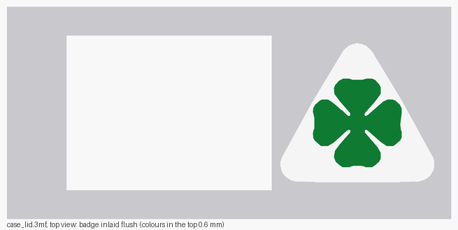

# Case for the CYD + ISO 9141 Click

Two-part printable case, generated by [`tools/make_case.py`](../tools/make_case.py):

| File | What | Size |
| --- | --- | --- |
| `case_fitcheck.stl` | Coupon with the CYD post pattern. **Print this first.** | 122 × 56 × 7.8 mm |
| `case_clickfit.stl` | Coupon with the Click holder, at the real board height. **Print this too.** | 37 × 39 × 13.9 mm |
| `case_bottom.stl` | Shell: floor, walls with openings, CYD posts, Click slide-in holder | 127.2 × 60.8 × 21.1 mm |
| `case_lid.3mf` | **Lid + badge as one object in three parts**, badge inlaid flush - open this for multi-colour printing | 127.2 × 60.8 × 8 mm |
| `case_lid.stl` | Lid: screen window and lip, **no badge** - the base part if you prefer STLs | 127.2 × 60.8 × 8 mm |
| `case_lid_badge_triangle.stl` | Badge triangle, inlaid in the lid's top 0.6 mm | 44 × 39.8 × 0.6 mm |
| `case_lid_badge_clover.stl` | Clover, inlaid in the same 0.6 mm | 25.3 × 25.3 × 0.6 mm |
| `case_lid_embossed.stl` | Lid with the badge raised 1.4 mm, for printing in one colour | 127.2 × 60.8 × 9.4 mm |

Assembled height is about 23.1 mm.

> **The CYD outline and hole pattern come from the manufacturer drawing** ([mischianti.org](https://mischianti.org/wp-content/uploads/2025/04/ESP32-2432S028-Cheap-Yellow-Display-Dimensions.jpg.webp)): board 86.0 x 50.0 mm, hole centres 4.0 mm in from each edge, so the pattern is **78 x 42 mm**, corners R1.6.
>
> **Everything else is still nominal** and not measured: the mounting hole diameter (assumed 3.0 mm, not dimensioned in the drawing), the position of the active display area on the board, the Click's outline and the height of its screw terminals. Print the fit-check coupon first; nobody has printed any of this yet.

## Layout

```text
   top view of the open shell
   +---------------------------------------------+
   |  o                           o  |           |
   |        [   CYD board     ]      |  [Click]  ]==  screw terminals
   |  o                           o  |           |      (opening in the wall)
   +---------------------------------[wires]-----+
```

- **The Click's pins set the height.** The lid is closed over the Click, so the pins (`CLICK_PIN_H`, 8 mm, **measure this** - more if plugs stay on with the lid shut) are the tallest thing inside: 19.1 mm of inner height.
- **The CYD posts are 11.5 mm tall**, derived, not fixed: the generator makes them exactly tall enough to bring the display to 2 mm under the lid, so the screen isn't sunk in a well. Change any height and the posts follow.
- **The lid is flat** at this height. If a change ever makes the Click taller than the display, the generator sinks the screen panel automatically instead.
- **The lid has no screws.** It drops in with a 6 mm lip, 0.3 mm clearance per side. If it's loose, raise `LID_CLEAR`; if it's tight, lower it.
- **Posts** are hollow for M3 self-tapping screws: 2.4 mm pilot for the CYD, 2.2 mm for the Click. The four CYD posts carry a **2.7 mm alignment pin, 1.8 mm tall**, that enters the board's mounting hole, so the board sits in place even without screws. If the pins don't enter, measure the hole and set `CYD_HOLE_DIA`; the pin is that minus `SPIGOT_CLEAR` (0.3 mm).
- **The Click slides into a holder, pins up** - its mounting holes aren't used. From [`iso_9141_click_v101.dxf`](../iso_9141_click_v101.dxf): outline 25.40 × 28.57 mm, two 8-pin headers 22.86 mm apart (1.27 mm from the long edges), pins running from 3.81 to 21.59 mm along the board.
  - **A pocket at the back edge** takes the last 3 mm of the board, where there are no pins. Nothing grips the long edges: a rail there would ride over the pin rows while sliding in.
  - **Two ledges** support the front corners from below, clear of the screw terminals in the middle. Their ramped snap nubs sit on top of the board and clear both pin columns.
  - **The board sits `CLICK_BOARD_Z` = 8.5 mm above the floor**: `CLICK_TERM_STACK` (7.0 mm of terminal under the board) plus 1.5 mm of air. **Measure the terminal height and correct `CLICK_TERM_STACK`** - it is the only number that sets the board height, and 7.0 is an estimate from the first fit print.
  - **Fitting:** wire the terminals, slide the back edge 3 mm into the pocket, then press the front down until it snaps over the nubs. Do any wiring to the pins before closing the lid: the lid covers the Click completely.
- **A quadrifoglio is embossed on the lid**, right of the screen window, **41 × 37 mm** in two levels: the rounded triangle stands 0.6 mm proud and the clover 1.4 mm, so the clover reads clearly against it.
  - **It is traced from an image**, so the shape is the real badge rather than my approximation of it:
    ```sh
    pip install pillow
    python3 tools/trace_badge.py clover.png
    ```
    That writes `tools/badge_data.py`, which `make_case.py` picks up automatically. Green pixels and the outline around them become the clover; the remaining grey becomes the triangle, filled solid.
  - **The image and the traced data are not in the repository** (car maker logos are trademarks): `clover.png` and `tools/badge_data.py` are in `.gitignore`. Without them the generator falls back to a clover drawn from curves, so the STLs still build.
  - `CLOVER = False` removes the badge; `CLOVER_H` and `CLOVER_TRI_H` set the two relief heights.
  - **Printing it in green:** the clover is the only thing above 3.0 mm from the lid's underside, so a filament change at that layer gives a green clover on a grey triangle.
- **One opening only:** the Click's terminal wires, in the front wall (x 95.1-117.1, 2.5-10.5 mm above the floor). Every other wall is solid. The K-line and 12 V wires go to the Click's screw terminals, so they leave through that opening. There is no USB cut-out; set `USB_OPENING = True` to get one back, and no opening behind the CYD where its micro-SD slot sits.

## Printing the badge in other colours (Bambu Studio + AMS)

**Open `case_lid.3mf`.** It holds one object made of three parts, already in
place: `lid`, `badge triangle` and `badge clover`. Right-click a part and pick
its filament, for example white for the triangle and green for the clover. The
file carries suggested colours (grey / white / green), which some slicers show
straight away.

**The badge is inlaid, not raised:** all three parts end flush at the lid
surface (2.0 mm), with the colours filling the top 0.6 mm, so the lid stays
flat and the badge is a colour change only. The parts deliberately overlap each
other and the lid; slicers give an overlap to the part listed last, which is
why the clover comes after the triangle. `BADGE_INLAY = False` in the generator
raises the badge instead, and `BADGE_INLAY_DEPTH` sets how deep the colours
reach.

If you would rather build it from STLs: open `case_lid.stl`, then right-click
the object, **Add part -> Load**, and pick `case_lid_badge_triangle.stl` and
`case_lid_badge_clover.stl`. Loading as a part keeps each file's coordinates,
so they land exactly on the lid.

The parts meet rather than overlap: the lid ends at 2.0 mm, the triangle runs 2.0-2.6 mm, the clover 2.6-3.4 mm, and the clover sits entirely within the triangle's footprint. For a single-colour print use `case_lid_embossed.stl` instead: there the badge stands 1.4 mm proud, so it is visible without a colour change. The inlaid badge would be invisible in one colour.

## Printing

- **Material:** PLA or PETG. PETG if it's going to sit in a car in the sun.
- **Layers:** 0.2 mm, 3 perimeters, 20% infill.
- **Orientation:** both parts flat on the bed as generated, no supports needed. The lid prints with the screen panel upwards.
- **Time:** the coupon is a few minutes; the shell is roughly 2–3 hours depending on the printer.

## Checking the fit, then adjusting

1. Print `case_fitcheck.stl` (CYD posts) and `case_clickfit.stl` (Click holder). The CYD should drop onto the pins without force, and the Click should slide into the rails and click past the nubs.
2. Measure anything that's off and change the numbers in the `PARAMETERS` block at the top of `tools/make_case.py`:
   - `CYD_W/D/T`, `CYD_HOLE_INSET_X/Y`, `CYD_HOLE_DIA` for the display board (outline and insets now match the drawing; only the hole diameter is a guess),
   - `CLICK_W/D/T` (from the DXF), `CLICK_TERM_STACK` and `CLICK_BOARD_Z` for the space under the board, `CLICK_RAIL_*`, `CLICK_LEDGE_LEN`, `CLICK_NUB_H` for the holder,
   - `CYD_SCREEN_W/D` and `CYD_SCREEN_OFF_X/Y` for the window over the display,
   - `CLICK_PIN_H` for the pin height (it sets the whole case height), `POST_H_MIN` for the minimum space under the CYD,
   - `WALL`, `FLOOR`, `GAP`, `GAP_Y`, `LID_CLEAR` for the case itself.
3. Regenerate: `python3 tools/make_case.py`

The window is `SCREEN_MARGIN` (1.2 mm) larger than the active display area. If the bezel peeks out, raise it; if the window covers pixels, lower it or shift the screen with `CYD_SCREEN_OFF_X/Y`.


